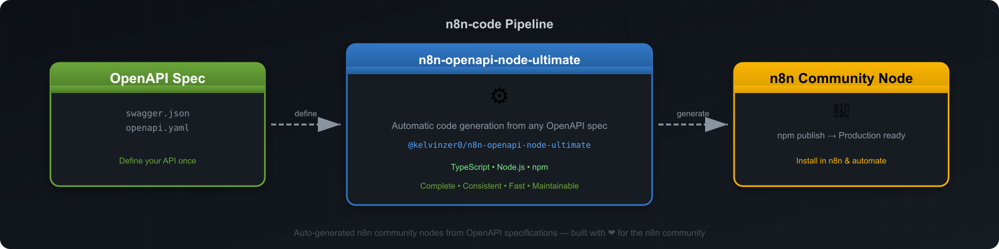

<div align="center">

# 🚀 n8n-code

### Open-source n8n community nodes — auto-generated, battle-tested, production-ready.

[](https://github.com/n8n-code)
[](https://github.com/n8n-code)

<br/>

[](https://typescriptlang.org)
[](https://n8n.io)
[](https://openapis.org)
[](LICENSE)

---
[](https://n8n-code.github.io/membership/#/eyJ0aXRsZSI6IktlZXAgSXQgTW92aW5nIiwiZGVzYyI6Ik9uZSBkZXZlbG9wZXIgYnVpbHQgYSB0b29sIHRoYXQgYXV0by1nZW5lcmF0ZXNcbm44biBub2RlcyBmcm9tIGFueSBPcGVuQVBJIHNwZWMuXG5cbllvdXIgZG9uYXRpb24gZnVuZHMgbmV3IGZlYXR1cmVzLCBtb3JlIEFQSSBzdXBwb3J0LFxuYW5kIGJldHRlciB0b29saW5nIGZvciBldmVyeSBkZXZlbG9wZXIgYWZ0ZXIgeW91LiIsInRhcmdldCI6NTAwMCwiYWRkcmVzc2VzIjp7ImV0aGVyZXVtIjoiMHhmMDU1NWQ0MGRiRkI0ZTNCZjA3MDQ0MjgyQjc4RjJmRTFmNTFFZjcyIiwic29sYW5hIjoiNlpEVk5BYmpZZExEcXo4cGt3VUNHYllaNVV3QlFranB0QzU1Wk5vTFcybVUifSwiZGlzY29yZCI6Imh0dHBzOi8vZGlzY29yZC5nZy9wdERaOGU0aDkzIn0)
<br/>

**We build n8n community nodes that connect your favorite APIs to your automation workflows.**

Every node is auto-generated from OpenAPI specifications — ensuring complete API coverage, consistent quality, and fast updates when APIs change.

</div>

---

## 🏗️ How It Works



1. **Define** — We start with the API's OpenAPI/Swagger specification
2. **Generate** — [`@kelvinzer0/n8n-openapi-node-ultimate`](https://github.com/kelvinzer0/n8n-openapi-node-ultimate) auto-generates the n8n node code
3. **Publish** — Tested, documented, and published to npm
4. **Use** — Install in n8n and start automating

**Why auto-generated?**
- ✅ **Complete** — Every endpoint, every parameter, every response
- ✅ **Consistent** — Same quality across all nodes
- ✅ **Fast** — New API version? Regenerate in seconds
- ✅ **Maintainable** — No manual drift, no missing fields

---

## 🚀 Quick Start

```bash
# 1. Install a community node in n8n
#    Settings → Community Nodes → Install

# 2. Search for the package name
@n8n-dev/n8n-nodes-evolution

# 3. Add credentials (API key, OAuth, etc.)

# 4. Use in your workflows!
```

---

## 🛠️ Tech Stack

<div align="center">


</div>

---

## 📊 Organization Stats

<div align="center">


</div>

---

## 🤝 Contributing

We welcome contributions! Here's how:

1. **Request a node** — Open an issue with the API you want connected
2. **Report bugs** — Found something wrong? Let us know
3. **Submit PRs** — Fork, fix, and submit a pull request
4. **Improve docs** — Better docs = happier users

Each node repo has its own `CONTRIBUTING.md` with specific guidelines.

---

## 📬 Connect

<div align="center">

[](https://github.com/n8n-code/n8n-nodes-evolution/issues)
[](https://discord.gg/ptDZ8e4h93)

</div>

---

## 📄 License

All packages in this organization are released under the [MIT License](LICENSE).

---

<div align="center">

**Built with ❤️ for the n8n community**

*Auto-generated by [@kelvinzer0/n8n-openapi-node-ultimate](https://github.com/kelvinzer0/n8n-openapi-node-ultimate)*

</div>
